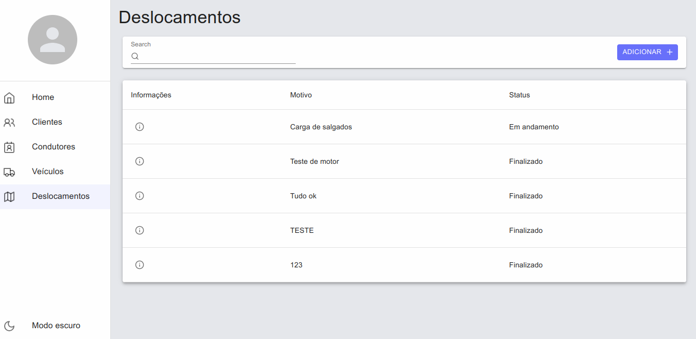
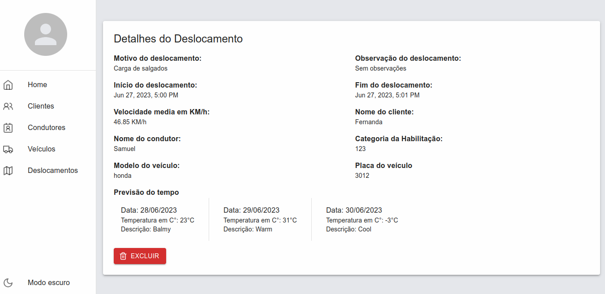

# DeslocaExpress

This is a displacement management application, developed to help control and organize information related to vehicle and driver displacements. With this application, it is possible to view, add, edit and delete trips, as well as obtain information about drivers, vehicles, customers and weather forecasts. The application was developed in NextJs with Typescript, using the material ui component library.

## Functionalities

The displacement management application has the following features:

- Theme exchange
- Listing, detailing, editing and deleting customers
- Listing, detailing, editing and deleting drivers
- Listing, detailing, editing and deleting vehicles
- Listing, detailing, editing and deleting displacements


## Technologies used

- Next 13.4
- TypeScript
- React
- Axios
- Zod
- Lucide Icons
- Material ui
- date fns
- React hook form
- <div> Icons by <a href="https://www.flaticon.com/br/autores/mj" title="mj"> mj </a> from <a href="https://www.flaticon.com/br/" title="Flaticon">www.flaticon.com'</a></div>

## How to use

To use the application, just access the link https://desloca-express.vercel.app/

## How to install locally

1. Download the project to your computer or clone the repository using the following command:

```Shell
git clone https://github.com/Guilherme-Silva0/DeslocaExpress.git
```

2. Open the terminal in the project directory and run the following command to install the dependencies:

```Shell
npm install
```

3. Then run the following command to launch the application:

```Shell
npm run dev
```

4. The application will open in your browser at the address [http://localhost:3000](http://localhost:3000).

## Screeshots

- Displacement listing page:
  

- Displacement details page:
  

## License

This project is licensed under the MIT. For more information, see the LICENSE file.

## Final considerations

Hope you enjoyed this project! If you have any questions or suggestions, please feel free to get in touch.